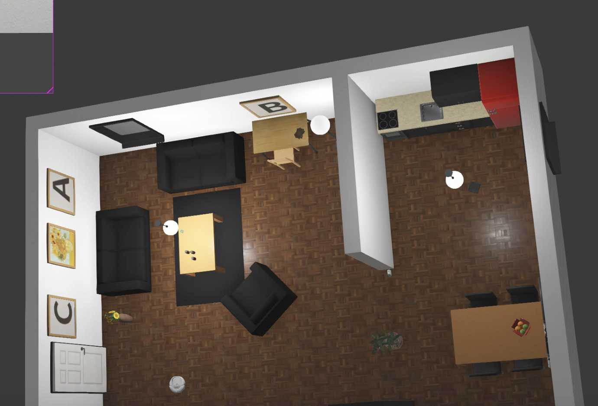

# seekslam_webots仿真程序
在webots 2025a机器人仿真软件中进行人工智能驱动的室内搜索目标并进行打击.(这句话语法有误)

|预览图|
|------|
||

## 使用说明
### 快速使用
打开`worlds`文件夹中的`mission6.wbt`文件即可打开仿真.控制器代码在`controllers`文件夹的`mission6_supervisor`文件夹中, 入口文件就是`mission6_supervisor.py`文件.

:: 注意: 需要修改服务器地址.

### 服务端本地部署方式
1. VGGT室内建图
[https://www.cnblogs.com/qsbye/p/18830067]
```sh
docker run -it -p 7863:7860 --platform=linux/amd64 --gpus all \
    registry.hf.space/facebook-vggt:latest python app.py
```
2. OCR字母目标识别
[https://www.cnblogs.com/qsbye/p/18831983]
```sh
# paddleocr_v4
docker pull registry.hf.space/paddlepaddle-paddleocr:cpu-49fcf58
docker run -it -p 7860:7860 --platform=linux/amd64 \
	registry.hf.space/paddlepaddle-paddleocr:cpu-49fcf58 python app.py
```

3. 深度估计
[https://www.cnblogs.com/qsbye/p/18840431]
```sh
docker run -it -p 7860:7860 --platform=linux/amd64 --gpus all \
	registry.hf.space/depth-anything-depth-anything-v2:zero-7f2e027 python app.py
```

4. ollama大模型
[https://www.cnblogs.com/qsbye/p/18835026]
```sh
ollama pull MFDoom/deepseek-r1-tool-calling:1.5b
ollama pull minicpm-v:latest
OLLAMA_HOST=0.0.0.0
```

## 开发说明
### 目录说明
```sh
- assets : 图片
- controllers : 机器人控制器
- examples : 示例代码
- protos : 机器人模型定义
- worlds : 仿真工程/虚拟世界
* webots.yaml : 工程定义
```

### 代码说明
```sh
* _camera.py : 机器人相机接口模块
* _controller.py : 机器人电机控制
* _depth.py : 深度估计模块
* _drone.py : 机器人类(传感器及执行器)
* _mapping.py : 建图模块
* _ocr.py : 目标识别模块
* _ollama.py : 大模型决策模块
* _pid.py : pid控制器模块
* _state.py : 任务状态机
* _supervisor.py : 机器人超类模块(可以当作外挂)
* _tasks.py : 任务模块
* _test.py : 测试模块
* _trajectory.py : 轨迹记录模块
* pyproject.toml : 记录python模块版本号
```
